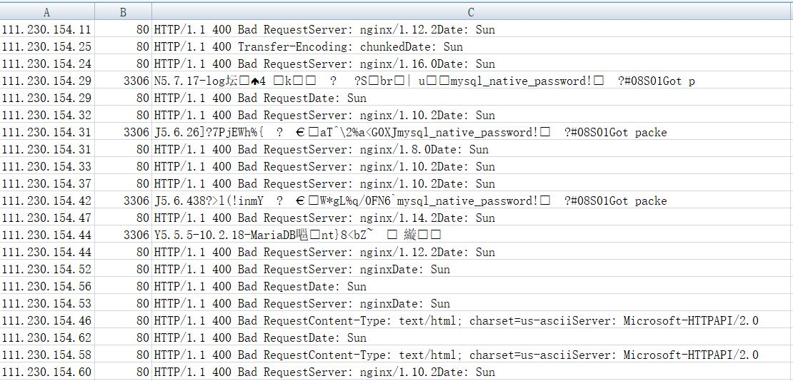

# 内网端口扫描

## 使用方法：

windows下面：

``` portscan.exe -H 127.0.0.1-127.0.0.254 -p 80,443,7001,3306```

liunx下面使用

``` python portscan -H 127.0.0.1-127.0.0.254 -p 80,443,7001,3306```

完成后会在当前目录生成cike.csv



